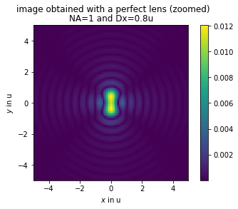

# PWD Plane wave decomposition Toolkit

  

## Contents
This package contains simple programs used to simulate how electromagnetic waves propagate from a nearfieldd source defined in a planar thin screen to the farfield.
It is based on decomposition of the nearfiel into the plane waves angular spectrum and can be easily implemented in numpy or matlab with the FFT algorithm.
It can be usefull for computing diffraction patterns in nearfield, Fresnel and Fraunhoffer conditions.
The example 1 given in the ntebook folder illustrates the Raileigh criterion that estimates the maximal reolution of a imaging optical system

This repository contains the following folders: 

* **matlab:** This folder contains matlab programs (also compatible with octave)

* **python:** This folder contains python programs 

* **notebook:** This folder contains jupyter notebook examples 

-Sylvain, 20/03/2022
